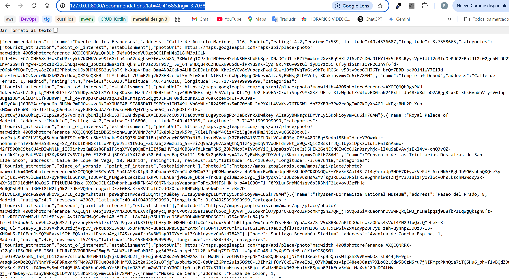
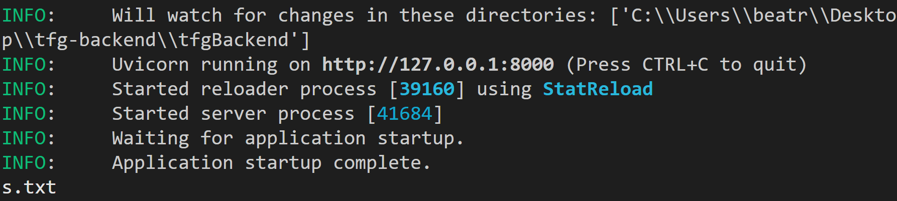
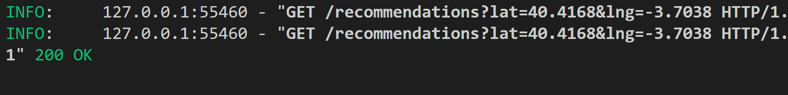

# tfgBackend


---
### Crear entorno virtual
> creado un entorno virtual con el comando ```python -m venv venv```

- lo que crea una carpeta venv/ que contiene las instalaciones de python y de pip que vamos a utilizar


---

---
### Activar entorno virtual creado
> ```venv/Scripts/activate```
*en la consola de powershell, este comando es funcional*
---


## FAST API
```
pip intall fastapi uvicorn requests python-dotenv
python.exe -m pip install --upgrade pip #actualizar
``` 

### archivo para guardar las dependencias
*esta creacion del archivo se usa mucho para el despliegue :)*

```
pip freeze > requirements.txt
```


### para probar el funcionamiento en el entorno en que lo hemos creado
```
uvicorn main:app --reload 
```

*sale not found (por parte de datos, que no han sido pasados como parametros)*

pero si a la url, le damos los parametros que necesita para su funcionamiento, si que obtenemos respuesta de nuestro servidor.

> http://127.0.0.1:8000/recommendations?lat=40.4168&lng=-3.7038




